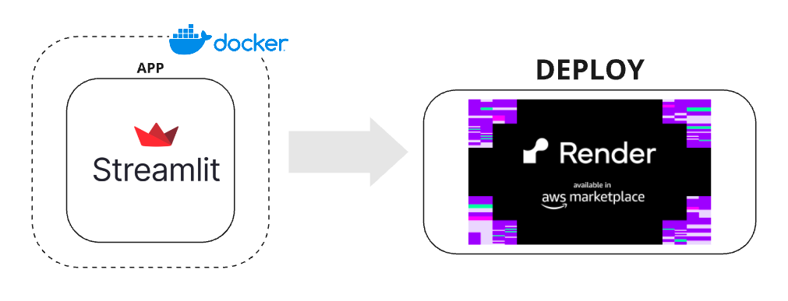

# Deploy de uma aplicação na Render

https://test-deploy-render-9zct.onrender.com/

**Goal**: Deploy an application to Render using Docker.

**Description**: Code in streamlit, build the Docker image and deploy it to Render.

**Technologies Used**:

- Docker
- Render
- Python